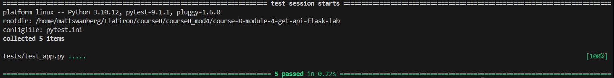

# Flask Products API

## Description

This project is a Flask API that provides routes for retrieving product data. The API allows users to view all products, filter products by category, and retrieve an individual product by its ID.

The project demonstrates the use of Flask routing, JSON responses, query parameters, dynamic URL parameters, and HTTP status codes.

## Features

- Displays a welcome message from the homepage
- Retrieves all available products
- Filters products by category using a query parameter
- Retrieves a specific product by its ID
- Returns appropriate HTTP status codes
- Returns a `404` status code when a requested product cannot be found

## Project Structure

```text
.
├── app.py
├── data.py
├── README.md
└── tests/
    └── test_app.py
```

## Installation

Clone the repository and navigate into the project directory:

```bash
git clone <repository-url>
cd <repository-name>
```

Install the required dependencies:

```bash
pip install flask pytest
```

## Running the Application

Run the Flask application with:

```bash
python app.py
```

The application will run in debug mode.

## API Routes

### Homepage

**GET /**

Returns a JSON welcome message.

Example response:

```json
{
  "message": "Welcome to my homepage"
}
```

**Status Code:** `200 OK`

---

### Get All Products

**GET /products**

Returns all products as JSON.

Example:

```text
http://127.0.0.1:5000/products
```

**Status Code:** `200 OK`

---

### Filter Products by Category

**GET /products?category=<category>**

Filters the product list using the `category` query parameter.

Example:

```text
http://127.0.0.1:5000/products?category=electronics
```

The category comparison is case-insensitive.

**Status Code:** `200 OK`

---

### Get Product by ID

**GET /products/<id>**

Returns the product whose ID matches the ID provided in the URL.

Example:

```text
http://127.0.0.1:5000/products/1
```

If the product exists, the API returns the product as JSON.

**Status Code:** `200 OK`

If no product with the requested ID exists, the API returns an empty JSON object:

```json
{}
```

**Status Code:** `404 Not Found`

## Testing

Run the test suite using:

```bash
pytest
```

To stop testing after the first failure:

```bash
pytest -x
```

The tests verify that the Flask routes return the expected JSON data and HTTP status codes.

## Concepts Practiced

- Flask application setup
- Flask routes
- Dynamic URL parameters
- Query parameters with `request.args`
- JSON responses with `jsonify`
- HTTP status codes
- Filtering Python lists
- Retrieving individual records by ID
- Handling missing resources with `404 Not Found`
- Testing Flask routes with pytest

## Screenshot



## Author

Created by Matthew Swanberg as part of Course 8 Module 4 (Building RESTful GET APIs with Flask)